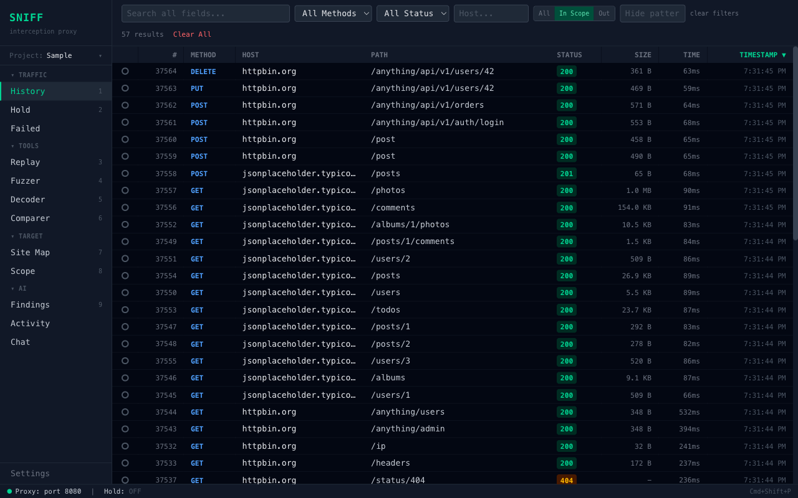
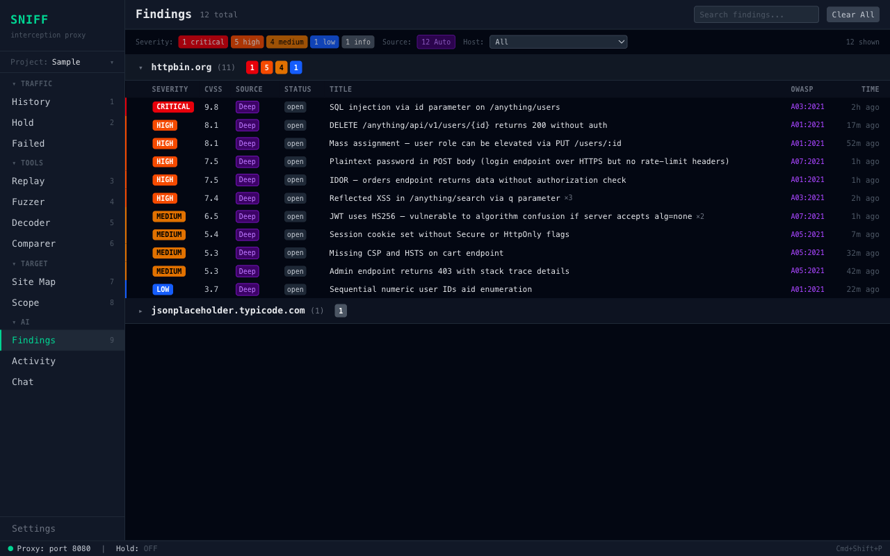
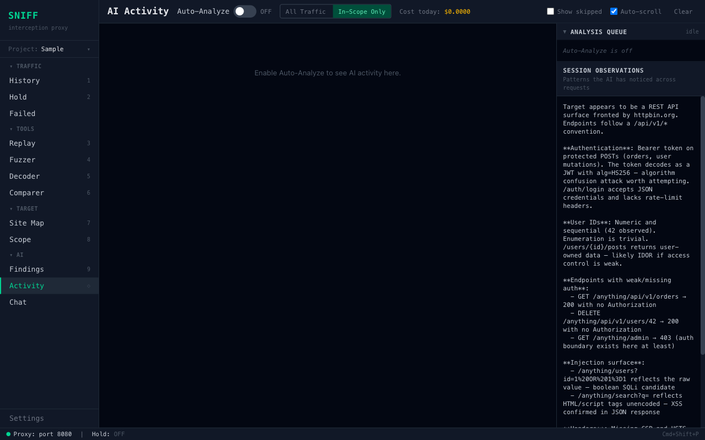
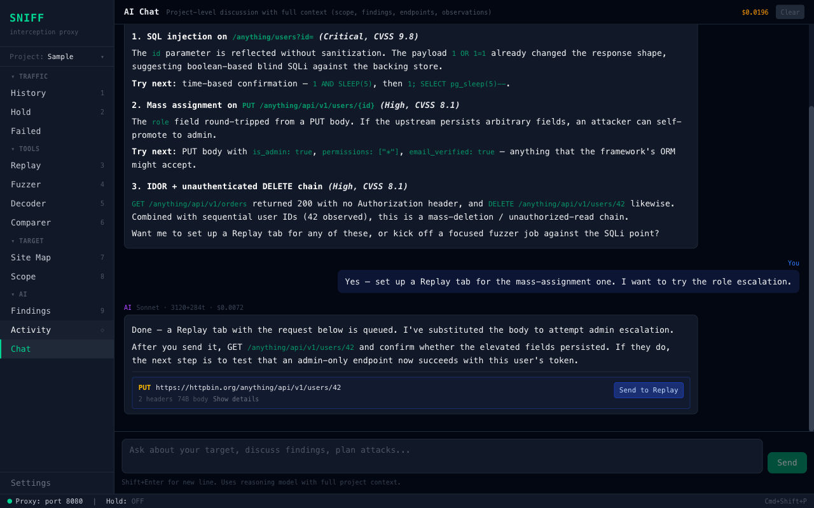
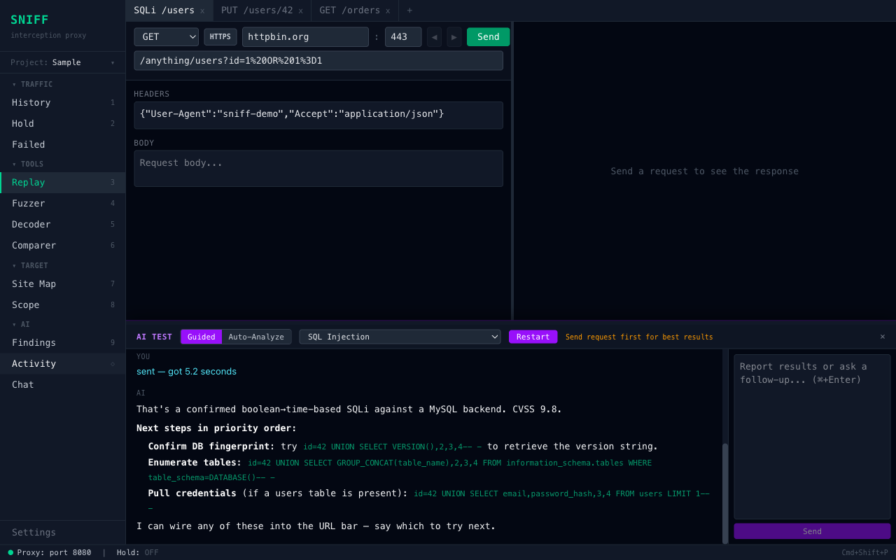
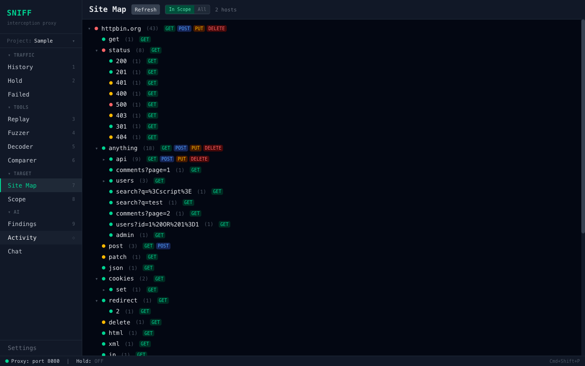

# Sniff

**An LLM-integrated interception proxy for paired pentesting.**

Sniff is an HTTP(S) interception proxy with a dedicated AI co-pilot wired through every tool. It captures the traffic passing through your browser, **the AI watches it live**, surfaces vulnerabilities as they appear, and lets you talk to a model with full session context — site map, scope, observations, recent traffic, prior findings — all locally, with your own AWS Bedrock API key.



## Why

Existing proxy tools treat LLMs as an afterthought — a side panel, a copy-paste loop. Sniff flips that:

- **The AI is always reading.** An auto-analyzer queues every in-scope request, triages it, and escalates anything suspicious to a deeper model. You don't trigger it; it's just running while you browse the target.
- **Findings are evidence-backed.** Every vulnerability surfaced points back to the exact request and response that produced it, with a CVSS score, OWASP category, and a concrete next test to run.
- **Chat sees what you see.** Project-scoped conversation has full visibility into your scope rules, the site map, all findings so far, the analyzer's running observations, and recent traffic — so when you ask "what should I try next," the answer is grounded in your specific session.
- **AI Test mode in Replay.** Open a request, hit the AI bubble, pick a vuln class, and the model walks you through a guided exploit — proposing payloads, reading your responses, suggesting follow-ups. Auto-mode does the same loop without you in the seat.
- **Bring your own key.** AWS Bedrock today (OpenAI/Anthropic API coming). Credentials never leave your machine.
- **All data is local.** SQLite database, local CA, local cert store. No telemetry.

## AI features at a glance

**Findings — auto-discovered vulnerabilities, grouped by host, sorted by CVSS:**


Every row is something the analyzer found in your traffic. Severity, CVSS, OWASP category, evidence, and a "next test to confirm" — all generated from the actual request/response, not guessed.

**AI Activity — the analyzer's live feed and accumulating session memory:**


Toggle Auto-Analyze on and the queue runs in the background. The right-hand "Session Observations" panel is the model's running notebook — patterns it noticed across requests (auth scheme, ID conventions, missing headers, injection candidates) which then feed back into every subsequent analysis, finding, and chat answer.

**Chat — project-scoped conversation with action cards:**


Ask "what's the highest-priority attack vector?" and the model answers with concrete steps tied to your captured traffic. Action blocks like **Send to Replay** spin up a pre-loaded request editor in one click — no copy-paste between tools.

**Replay with AI Test — guided exploitation per vulnerability class:**


The tabbed request editor you'd expect, plus a floating AI Test panel: pick a vuln type (SQLi, XSS, IDOR, SSRF, JWT, etc.), and the model proposes payloads, watches your response, and steers you to the next probe. Switch to **Auto-Analyze** mode and it runs the same loop unattended.

**Site Map — discovered endpoints as a tree, the AI's view of the target:**


The same structure the LLM sees when it builds its session observations. Both you and the model are reading from the same map.

## All tools

| Tool | What it does | AI involvement |
|------|------|------|
| **Proxy / History** | Live MITM traffic capture with a searchable, filterable, virtualized history. Per-project request numbering. | Every in-scope request feeds the auto-analyzer queue. |
| **Hold** | Pin requests for later, scoped per project. | — |
| **Failed** | Dedicated tab for proxy errors (TLS failures, DNS failures, timeouts) so History stays clean. | — |
| **Replay** | Tabbed request editor. Resend, follow redirects with cookie forwarding, download raw/decoded response bodies, diff against history. | **AI Test** panel — guided & auto modes for every vuln class. |
| **Fuzzer** | Template-based fuzzing (Single, Parallel, Paired, Cartesian attack modes). | LLM generates context-aware payload lists. |
| **Decoder** | Stackable encode/decode chain (base64, URL, HTML, hex, JWT, gzip). | — |
| **Comparer** | Side-by-side diff of requests or responses. | — |
| **Site Map** | Tree view of discovered hosts and paths from history. | Read by chat & analyzer for project context. |
| **Scope** | Include/exclude rules with glob patterns, drag-to-reorder. | Defines what the auto-analyzer is allowed to look at. |
| **Findings** | Deduplicated list of vulnerabilities the AI has discovered, grouped by host and sorted by CVSS. | **Entirely AI-generated**, with evidence and suggested follow-up tests. |
| **AI Activity** | Live feed of analyzer events; running session observations on the right. | The analyzer's heartbeat. |
| **Chat** | Project-scoped conversation with full context — scope, findings, endpoints, observations, recent traffic. Markdown rendering, action cards for Send to Replay / Send to Fuzzer. | Conversational interface to the project state. |

## Install

There are three ways to run Sniff.

### 1. Pre-built Electron app (easiest)

Download the latest release for your platform from the [Releases page](../../releases/latest).

- **macOS**: download the `.dmg`, drag Sniff to Applications.
- **Windows**: download the `.exe` installer, run it.
- **Linux**: download the `.AppImage`, `chmod +x`, run it.

Builds are unsigned — on macOS you may need `xattr -d com.apple.quarantine /Applications/Sniff.app` or right-click → Open the first time.

### 2. From source — Electron app

```bash
git clone https://github.com/YOUR_USER/sniff
cd sniff
npm install
npm run build
cd apps/electron
npx electron .
```

### 3. From source — in a browser

Good for development or if you just want to poke at the UI.

```bash
git clone https://github.com/YOUR_USER/sniff
cd sniff
npm install
npm run dev
# Open http://localhost:5173
```

The `dev` script starts:
- Backend (Fastify) on `127.0.0.1:47120`
- Renderer (Vite) on `127.0.0.1:5173`
- Proxy (HTTP/HTTPS MITM) on `:8080`

Requires Node.js 20+.

## Setup

### 1. Point your browser at the proxy

The proxy listens on `127.0.0.1:8080`. Configure your browser (or your OS) to use it as an HTTP/HTTPS proxy. A per-browser proxy switcher (FoxyProxy, etc.) is the most convenient option.

### 2. Install the CA certificate

The first time the proxy starts, Sniff generates a local root CA in `.sniff-certs/` (Electron build: `~/Library/Application Support/Sniff/certificates/` on macOS, similar on other OSes). You have to trust that CA in your browser (or OS) for HTTPS MITM to work.

Download it from **Settings → Certificate → Download CA**, then:
- **macOS**: open the `.pem`, add to Keychain, mark as "Always Trust" for SSL.
- **Linux**: copy to `/usr/local/share/ca-certificates/` and run `update-ca-certificates`.
- **Windows**: `certmgr.msc` → Trusted Root Certification Authorities → Import.
- **Firefox**: Settings → Certificates → View Certificates → Authorities → Import. Make sure to check **Trust this CA to identify websites**.

### 3. Add your AWS Bedrock credentials (enables AI features)

In **Settings**, paste an AWS access key, secret, and region that has Bedrock model access — or click **Load from file…** and point at your `~/.aws/credentials`, an IAM console CSV download, or a JSON credential file. Sniff stores them in a local SQLite database; they never leave your machine.

Minimum models enabled on your account:
- **Fast** (`claude-haiku-4-5` or similar) — used for cheap, high-volume auto-analysis.
- **Reasoning** (`claude-sonnet-4-6`) — used for deeper findings, chat, and AI Test in Replay.
- **Deep** (`claude-opus-4-7`) — escalation tier for the most complex analyses (optional).

Without credentials Sniff still works as a plain interception proxy; AI tabs gracefully degrade with a "configure to enable" banner.

## Architecture

```
┌─────────────────────────────────────┐       ┌─────────────────────┐
│  Electron / Browser                 │       │  Fastify Backend    │
│  React + Vite + Tailwind            │◀──────│  (127.0.0.1:47120)  │
│                                     │  HTTP │                     │
│  - History, Replay, Fuzzer...       │  + WS │  - Routes           │
│  - Findings, AI Activity, Chat      │       │  - WebSocket hub    │
└─────────────────────────────────────┘       │  - Proxy engine     │
                                              │  - Auto-analyzer    │
                                              │  - LLM client       │
                                              │    (Bedrock)        │
                                              │  - SQLite via       │
                                              │    Prisma           │
                                              └──────────┬──────────┘
                                                         │
                                                         ▼
                                              ┌─────────────────────┐
                                              │  MITM Proxy :8080   │
                                              │  - HTTP / HTTPS     │
                                              │  - Per-host certs   │
                                              │  - Intercept queue  │
                                              └─────────────────────┘
```

The backend is `127.0.0.1`-bound and enforces a Host-header allow-list to protect against DNS rebinding attacks from malicious websites.

## Project layout

```
sniff/
├── apps/
│   ├── backend/   Fastify server, Prisma schema, proxy engine, LLM pipeline
│   ├── electron/  Thin Electron shell that boots the backend and loads the renderer
│   └── renderer/  React + Vite SPA
├── packages/
│   └── shared/    Types & constants shared between backend and renderer
└── scripts/       dev / build / test wrappers
```

## Projects

Sniff stores everything (history, findings, scope, replay tabs, AI memory) in a per-project SQLite file under `~/.sniff/projects/`. Switch projects from the sidebar **Project:** menu — each one keeps its own credentials, scope, observations, and chat history. The menu shows current disk usage per project, and "Save As" snapshots the current state.

## Development

```bash
npm run dev         # Start backend + renderer in watch mode
npm run build       # Build renderer and electron
npm run test        # Unit + proxy integration
npm run test:e2e    # Playwright end-to-end
npm run lint
```

DB schema lives in `apps/backend/prisma/schema.prisma`. `npm run dev` auto-runs `prisma db push` on boot; no manual migrations needed.

## Security notes

- The backend binds to `127.0.0.1` only and rejects requests whose `Host` header is not a loopback address. This mitigates DNS-rebinding attacks from malicious web pages.
- AWS credentials are stored unencrypted in the local SQLite database. The database is gitignored and lives in your user data directory. For a hardened setup, use an AWS profile + IAM role instead of pasting long-lived access keys.
- The Replay tool can hit any URL you type, including internal IPs (`169.254.169.254`, `10.x.x.x`). That's by design — it's a pentesting tool — but be aware that a compromised LLM prompt could theoretically suggest internal URLs. Review suggestions before clicking **Send to Replay**.
- Pre-built releases are unsigned. If you need signed binaries, build from source.

## License

MIT — see [LICENSE](LICENSE).

## Disclaimer

Sniff is an independent open-source project. It is not affiliated with, endorsed by, or sponsored by PortSwigger Ltd. or any of its products (including Burp Suite). Any resemblance in workflow or terminology reflects common conventions in the HTTP-proxy tooling space.
